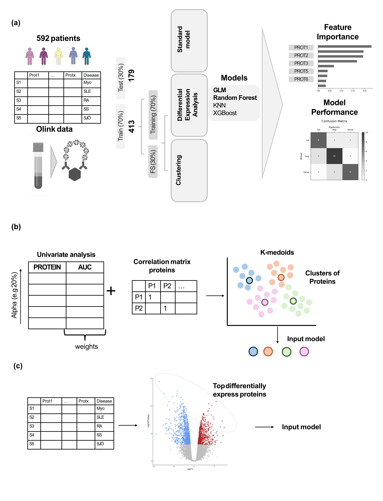

# Machine Learning-Based Profiling of Autoimmune Diseases

Field: AI

### **Background:**

Autoimmune diseases are characterised by immune system dysregulation, leading to the production of self-antibodies, activation of immune cells, and chronic expression of proinflammatory cytokines, which can affect various organs or have systemic effects [(Pisetsky, 2023)](https://www.zotero.org/google-docs/?Ni1SBC). Diagnosing these diseases is challenging due to their heterogeneity, symptoms that overlap with other conditions and frequent comorbidities that increase the risk of mortality. These complexities highlight the need for novel biomarkers to improve early diagnosis, patient stratification, and treatment evaluation in autoimmune disease populations.

As part of the Human Disease Blood Atlas program, plasma profiling was conducted for five autoimmune diseases: myositis (n=210), rheumatoid arthritis (n=84), systemic sclerosis (n=100), Sjögren’s syndrome (n=99), and systemic lupus erythematosus (n=99). 592 plasma samples were analysed using the Olink Explore 1536 platform, a highly sensitive, multiplexed antibody-based technology that produced expression data for 1,163 unique proteins. Differential expression analysis revealed several potential prognostic biomarkers, some previously linked to autoimmune diseases and others novel.

### **Project Objective:**

This project aims to implement and compare machine learning methods for profiling autoimmune diseases, focusing on evaluating biomarkers as predictors of disease type and feature selection from plasma protein data [(Álvez et al., 2023)](https://www.zotero.org/google-docs/?Bf43fV).

### **Methodology**:

To this end, candidate biomarkers identified from differential expression analysis will undergo further feature selection. We will explore different classification models, such as k-Nearest Neighbour (kNN), Random Forest, and Generalized Linear Models (GLM), to predict disease type. The model will be evaluated based on its ability to differentiate between diseases. This will help confirm the clinical relevance of these biomarkers in a broader population and assess their utility in diagnosis and treatment monitoring. We also tried different feature selection strategies.

### The repository

R notebook with the training and evaluation of the different models :

- Training_and_evaluation.Rmd

R script with visualization and automatization functions used in Training_and_evaluation.Rmd:

- Utils.R